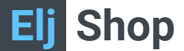

    

 

## Description
This project builds a shoe selling website these following with features:
* Authenticationand authorization
* Shopping feature: view product list, search and filter product, manage cart, order placement, feedback purchased product
* Profile management
* User management
* Product management
* Provider management
* Voucher management
* Order management
* Employee report

See [Features](#features) section for more details\
[Technologies](#technologies) use in this project
## Visuals
Updating...

## Features
On some READMEs, you may see small images that convey metadata, such as whether or not all the tests are passing for the project. You can use Shields to add some to your README. Many services also have instructions for adding a badge.

## Technologies
1. Tools:
    * JDK 8
    * IDE: Apache NetBeans IDE 13
    * DBMS: Microsoft SQL Server Management Studio 19
    * Server: Apache Tomcat 10.0
2. MVC2 model:
    * Model: Java Bean
    * View: JSP, JSTL, HTML5, CSS, JS
    * Controller: Servlet, Filter
3. Libraries (all libraries included in [lib](lib) folder):
    * JDBC Driver 6.0
    * jakarta.servlet.jsp.jstl-2.0.0
    * jakarta.servlet.jsp.jstl-api-2.0.0
    * commons-logging-1.2
    * fluent-hc-4.5.5
    * gson-2.8.2
    * httpclient-4.5.5
    * httpcore-4.4.9
    * javax.mail

## Installation
Updating...

## Usage
Updating...

## Contributors
* [Nguyen Ngoc Tuan Huy](https://github.com/NNTH287)
* [Le Dang Huy](https://github.com/jaxkryan)
* [Nguyen Dang Long](https://www.facebook.com/profile.php?id=100017849490446)
* [Nguyen Tien Hung](https://github.com/NTienHung)
* [Dinh Thu Ngan](https://www.facebook.com/dinhthungan1006)
* [Pham Hoang Nam](https://github.com/YukineDL)

## License
This project is licensed under the **MIT license**. Feel free to edit and distribute this template as you like.

See [LICENSE](LICENSE) for more information.